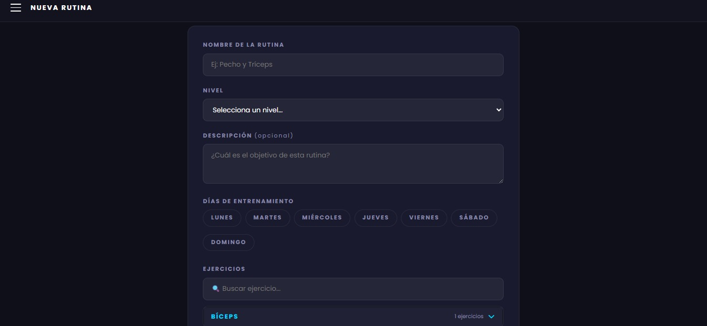

# Nombre del Proyecto
Página Gimnasio  

## Descripción
Aplicación web en Django para gestión de gimnasio, venta de planes, administración de usuarios y creación/seguimiento de rutinas de ejercicio.  

## Instalación

### Requisitos
- Python 3.11  
- Virtualenv (recomendado)  
--FF
### Pasos sugeridos

1. Clona el repositorio o copia el proyecto a tu máquina.  

2. Navega al directorio del proyecto:

cd "c:\Users\crist\OneDrive\Documentos\Pagina-Gimnasio"

3. Crea y activa un entorno virtual:

python -m venv venv  
.\venv\Scripts\Activate.ps1  

4. Instala dependencias:

pip install -r requirements.txt  

5. Aplica migraciones:

django-admin migrate  

6. Crea un superusuario para acceder al admin:

django-admin createsuperuser  

## Uso

### Ejecución
Inicia el servidor de desarrollo:

django-admin runserver  

Luego abre en el navegador:  
http://127.0.0.1:8000/  

### Rutas principales
- / : página de presentación  
- /planes/ : listados de planes disponibles  
- /sobreNosotros/ : página sobre el gimnasio  
- /galeria/ : galería de imágenes  
- /comprar/<id_plan>/ : comprar un plan  
- /inicio/ : inicio de sesión o página principal después de login  
- /usuarios/login/ : login de usuario  
- /usuarios/logout/ : cerrar sesión  
- /rutinas/ : listado de rutinas  
- /rutinas/crear/ : crear rutina  
- /rutinas/<pk>/ : detalle de rutina  
- /rutinas/<pk>/editar/ : editar rutina  
- /rutinas/<pk>/eliminar/ : eliminar rutina  
- /rutinas/<pk>/iniciar/ : iniciar sesión de entrenamiento  
- /rutinas/sesion/<pk>/ : ejecutar rutina de entrenamiento  
- /rutinas/sesion/<pk>/finalizar/ : finalizar sesión  
- /rutinas/historial/ : historial de sesiones  

## Autores

Nombre | Código | Rol | Correo  
--- | --- | --- | ---  
Ana María Tique | 2220241069 | Front-end developer | ana.tique1@estudiantesunibague.edu.co  
Yaritxa Duarte | 2220241061 | Back-end developer | yaritxa.duarte@estudiantesunibague.edu.co  

## Flujo de trabajo Git

Durante el desarrollo se utilizó una estrategia basada en Git Flow.

- La rama develop se utilizó para integrar los cambios principales del proyecto.
- Las ramas feature/ se utilizaron para desarrollar nuevas funcionalidades y mejoras.
- La rama release/v1.0.0 se utilizó para preparar la versión final antes de integrarla en main.
- La rama hotfix/readme-typo se utilizó para corregir errores específicos del README.
- Finalmente, se preparó el tag v1.0.0 para identificar la primera versión estable del proyecto.

## Evidencias
existe

Se incluye el tag v1.0.0 como versión final del proyecto.

Se presentan evidencias del uso de ramas develop, feature/*, release y hotfix.

Se adjuntan capturas, commits y referencias del funcionamiento del sistema.
[Vista del frontend](docs/foto1.jpeg)

